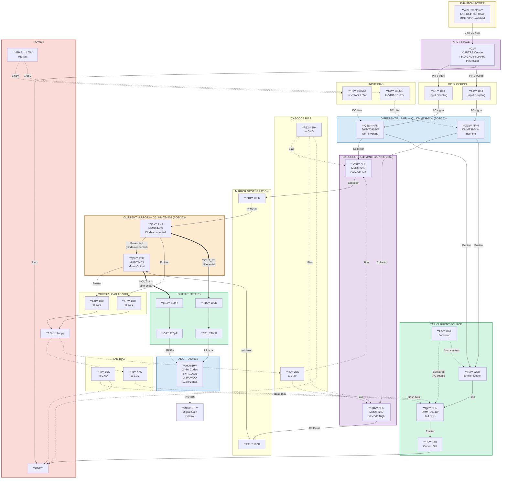

# AK4619 Direct-to-ADC Mic Preamp — Mermaid Diagrams

## Block-Level Overview

```mermaid
flowchart LR
    J1["**XLR Input**\nJ1\nBalanced"]

    PHANTOM["**48V Phantom**\nR13,R14: 6K8\nMCU switched"]

    COUPLING["**DC Block**\nC1,C2: 10µF"]

    BIAS["**Bias Network**\nR1,R2: 100MΩ\nVBIAS = 1.65V"]

    DIFF["**Diff Pair**\nQ1: DMMT3904W\nIc = 0.45mA"]

    CASCODE["**Cascode**\nQ4: MMDT2227\nVb = 1.03V"]

    MIRROR["**Current Mirror**\nQ3: MMDT4403\nR7,R8: 1K0 loads\nR10,R11: 100R degen"]

    TAIL["**Tail CCS**\nQ2: DMMT3904W\nR3: 220R, R5: 3K3\nC5: Bootstrap"]

    OUTFILT["**Output Filter**\nR15,R16: 100R\nC3,C4: 220pF\nf-3dB ≈ 7.2MHz"]

    ADC["**AK4619**\n24-bit Codec\nSNR 106dB\nLRIN1 diff input"]

    MCU["**MCU/DSP**\nDigital gain\nI2S/TDM"]

    PWR["**Power**\n3.3V single supply\nC8-C13 decoupling"]

    J1 ==>|"Hot  Pin2\nCold Pin3"| COUPLING
    PHANTOM -.->|"48V via 6K8"| J1
    COUPLING ==>|"AC coupled\ndifferential"| DIFF
    BIAS -.->|"DC bias\n1.65V"| DIFF
    DIFF ==>|"Collectors"| CASCODE
    DIFF -->|"Emitters"| TAIL
    CASCODE ==>|"Collectors"| MIRROR
    MIRROR ==>|"OUT_P\nOUT_N\ndifferential"| OUTFILT
    OUTFILT ==>|"LRIN1+\nLRIN1−"| ADC
    ADC ==>|"I2S / TDM\n24-bit audio"| MCU
    PWR -.->|"3.3V, GND"| DIFF
    PWR -.->|"3.3V"| MIRROR
    PWR -.->|"AVDD, DVDD"| ADC
    TAIL -.->|"0.9mA total"| DIFF

    style J1 fill:#e8daef,stroke:#8e44ad,stroke-width:2px
    style PHANTOM fill:#fef9e7,stroke:#d4ac0d,stroke-width:2px
    style COUPLING fill:#f2f3f4,stroke:#7f8c8d,stroke-width:2px
    style BIAS fill:#f2f3f4,stroke:#7f8c8d,stroke-width:2px
    style DIFF fill:#d6eaf8,stroke:#2980b9,stroke-width:2px
    style CASCODE fill:#d6eaf8,stroke:#2980b9,stroke-width:2px
    style MIRROR fill:#fdebd0,stroke:#e67e22,stroke-width:2px
    style TAIL fill:#d5f5e3,stroke:#27ae60,stroke-width:2px
    style OUTFILT fill:#d5f5e3,stroke:#27ae60,stroke-width:2px
    style ADC fill:#dbeafe,stroke:#2563eb,stroke-width:2px
    style MCU fill:#dbeafe,stroke:#2563eb,stroke-width:2px
    style PWR fill:#fadbd8,stroke:#c0392b,stroke-width:2px
```

---

## Detailed Component-Level View

```mermaid
flowchart TB
    subgraph INPUT["INPUT STAGE"]
        J1["**J1**\nXLR/TRS Combo\nPin1=GND Pin2=Hot Pin3=Cold"]
    end

    subgraph PHANTOM["PHANTOM POWER"]
        PP["**48V Phantom**\nR13,R14: 6K8 0.5W\nMCU GPIO switched"]
    end

    subgraph COUPLING["DC BLOCKING"]
        C1["**C1** 10µF\nInput Coupling"]
        C2["**C2** 10µF\nInput Coupling"]
    end

    subgraph BIAS["INPUT BIAS"]
        R1["**R1** 100MΩ\nto VBIAS 1.65V"]
        R2["**R2** 100MΩ\nto VBIAS 1.65V"]
    end

    subgraph DIFFPAIR["DIFFERENTIAL PAIR — Q1: DMMT3904W (SOT-363)"]
        Q1a["**Q1a** NPN\nDMMT3904W\nNon-inverting"]
        Q1b["**Q1b** NPN\nDMMT3904W\nInverting"]
    end

    subgraph CASCODE["CASCODE — Q4: MMDT2227 (SOT-363)"]
        Q4a["**Q4a** NPN\nMMDT2227\nCascode Left"]
        Q4b["**Q4b** NPN\nMMDT2227\nCascode Right"]
    end

    subgraph CASCBIAS["CASCODE BIAS"]
        R9["**R9** 22K\nto 3.3V"]
        R12["**R12** 10K\nto GND"]
    end

    subgraph MIRROR["CURRENT MIRROR — Q3: MMDT4403 (SOT-363)"]
        Q3a["**Q3a** PNP\nMMDT4403\nDiode-connected"]
        Q3b["**Q3b** PNP\nMMDT4403\nMirror Output"]
    end

    subgraph MIRRORLOAD["MIRROR LOAD TO VDD"]
        R7["**R7** 1K0\nto 3.3V"]
        R8["**R8** 1K0\nto 3.3V"]
    end

    subgraph DEGEN["MIRROR DEGENERATION"]
        R10["**R10** 100R"]
        R11["**R11** 100R"]
    end

    subgraph TAIL["TAIL CURRENT SOURCE"]
        R3["**R3** 220R\nEmitter Degen"]
        Q2["**Q2** NPN\nDMMT3904W\nTail CCS"]
        R5["**R5** 3K3\nCurrent Set"]
        C5["**C5** 10µF\nBootstrap"]
    end

    subgraph TAILBIAS["TAIL BIAS"]
        R4["**R4** 10K\nto GND"]
        R6["**R6** 47K\nto 3.3V"]
    end

    subgraph OUTFILT["OUTPUT FILTERS"]
        R15["**R15** 100R"]
        C3["**C3** 220pF"]
        R16["**R16** 100R"]
        C4["**C4** 220pF"]
    end

    subgraph ADC["ADC — AK4619"]
        AK["**AK4619**\n24-bit Codec\nSNR 106dB\n3.3V AVDD\n192kHz max"]
    end

    subgraph POWER["POWER"]
        VDD["**3.3V** Supply"]
        GND["**GND**"]
        VBIAS["**VBIAS** 1.65V\nMid-rail"]
    end

    %% Signal path
    J1 -->|"Pin 2 (Hot)"| C1
    J1 -->|"Pin 3 (Cold)"| C2
    J1 -->|"Pin 1"| GND

    PP -->|"48V via 6K8"| J1

    C1 -->|"AC signal"| Q1a
    C2 -->|"AC signal"| Q1b

    R1 -.->|"DC bias"| Q1a
    R2 -.->|"DC bias"| Q1b
    VBIAS -.->|"1.65V"| R1
    VBIAS -.->|"1.65V"| R2

    Q1a -->|"Collector"| Q4a
    Q1b -->|"Collector"| Q4b

    Q1a -->|"Emitter"| R3
    Q1b -->|"Emitter"| R3

    R3 -->|"Tail"| Q2
    Q2 -->|"Emitter"| R5
    R5 --> GND

    C5 -.->|"Bootstrap\nAC couple"| Q2
    C5 -.->|"from emitters"| R3

    R6 -.->|"Base bias"| Q2
    R4 -.->|"Base bias"| Q2
    VDD -.-> R6
    R4 -.-> GND

    Q4a -->|"Collector"| R10
    Q4b -->|"Collector"| R11

    R9 -.->|"Bias"| Q4a
    R9 -.->|"Bias"| Q4b
    R12 -.->|"Bias"| Q4a
    R12 -.->|"Bias"| Q4b
    VDD -.-> R9
    R12 -.-> GND

    R10 -->|"to Mirror"| Q3a
    R11 -->|"to Mirror"| Q3b

    Q3a -->|"Bases tied\n(diode-connected)"| Q3b

    Q3a -->|"Emitter"| R7
    Q3b -->|"Emitter"| R8
    R7 --> VDD
    R8 --> VDD

    Q3a ==>|"**OUT_P**\ndifferential"| R15
    Q3b ==>|"**OUT_N**\ndifferential"| R16

    R15 --> C3
    R16 --> C4

    C3 -->|"LRIN1+"| AK
    C4 -->|"LRIN1−"| AK

    AK -->|"I2S/TDM"| MCU["**MCU/DSP**\nDigital Gain\nControl"]

    %% Styling
    style INPUT fill:#e8daef,stroke:#8e44ad,stroke-width:2px
    style DIFFPAIR fill:#d6eaf8,stroke:#2980b9,stroke-width:2px
    style CASCODE fill:#e8daef,stroke:#8e44ad,stroke-width:2px
    style MIRROR fill:#fdebd0,stroke:#e67e22,stroke-width:2px
    style TAIL fill:#d5f5e3,stroke:#27ae60,stroke-width:2px
    style OUTFILT fill:#d5f5e3,stroke:#27ae60,stroke-width:2px
    style ADC fill:#d6eaf8,stroke:#2563eb,stroke-width:2px
    style PHANTOM fill:#fef9e7,stroke:#d4ac0d,stroke-width:2px
    style POWER fill:#fadbd8,stroke:#c0392b,stroke-width:2px
```
