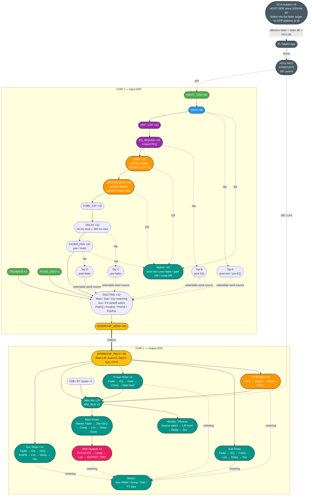

# D32 SHARC Full Flow Cross-Check Diagram

This layout mirrors the older reference style from [../D24/DSP/SHARC/dsp_diagram.png](../../D24/DSP/SHARC/dsp_diagram.png) while using the current D32 graph structure from [dsp.csv](dsp.csv).

## Full printable view

