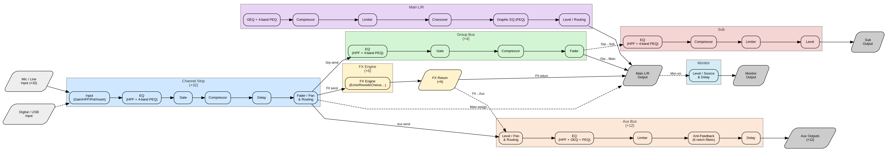

# DSP Block Diagram (partial)

> Generated from `mx_master.csv` by `gen_diagram.py`.  
> Rows with `Save2Mix=false` (UI-only / sys control) are excluded.  
> Each strip shows the DSP processing stages in signal-flow order
> derived from the `StripOrder` column.

## Channel Strip → Bus Overview

[PNG](block_diagram.png) · [SVG](block_diagram.svg) · [DOT](block_diagram.dot)

## Strip Types Decoded

| StripType | Count | Processing Chain |
|-----------|-------|------------------|
| **Chan** | ×32 | ChanInput → Chan_Eq → ChanGate → ChanComp → ChanDelay → Chan_Rtg |
| **Grp** | ×4 | GrpEq → GrpGate → GrpComp → GrpRtg |
| **Fx** | ×6 | FxCtrl |
| **Aux** | ×12 | AuxRtg → AuxEq → AuxLimiter → AuxAntiFb → AuxDelay |
| **Main** | ×1 | MainEq → MainComp → MainLimiter → MainCrossover → MainPeq → MainRtg |
| **Sub** | ×1 | SubEq → SubComp → SubLimiter → SubRtg |
| **Mon** | ×1 | MonCtrl |
